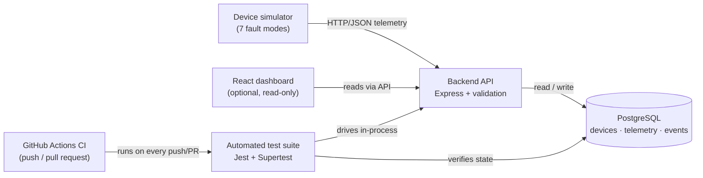

# Embedded/IoT Test Automation Harness

[](https://github.com/Wale1202/Embedded-IoT-Test-Automation-Harness/actions/workflows/ci.yml)

A backend that simulates embedded/IoT devices reporting telemetry to a
"ground" server, focused on **verifying the device-to-backend data
path** — validation, failure detection, and an auditable event trail —
rather than just collecting data.

> **Scope:** this is a graduate portfolio project, intentionally scoped
> as an MVP. It is not a product. The goal is to demonstrate testing and
> verification thinking on a realistic device→backend problem, with the
> reasoning written down rather than hidden.

---

## 1. Why I built it

I'm aiming for a graduate **Embedded Test Engineer** role in
aerospace / space communications. Most embedded test work isn't writing
firmware — it's proving that a device's data survives an unreliable link
and that the ground software correctly handles every way that data can
arrive *wrong*.

I wanted a project that let me practise exactly that: defining failure
modes, building automated checks for them, and being honest about scope
and trade-offs. Telemetry ingest is a clean stand-in for a real
spacecraft/sensor downlink without needing hardware.

## 2. How it relates to embedded software testing & device-to-backend validation

The simulated device is the "spacecraft", the backend is the "ground
segment", and the test suite is the verification system. The interesting
work mirrors real embedded test engineering:

- **Data integrity at the boundary** — every telemetry frame is
  validated against physical sensor limits before it is trusted.
- **Fault injection** — the simulator deliberately produces malformed,
  duplicate, stale, and out-of-range frames on demand, the software
  equivalent of a bench test rig feeding bad signals into a DUT.
- **Detect, respond, *and record*** — a real programme needs evidence
  of what failed and when, so every detected failure is written to a
  `device_events` audit table, not just rejected.
- **Requirements → tests → evidence** — each failure scenario has a test
  case ID that maps 1:1 from [TEST_PLAN.md](TEST_PLAN.md) to the
  automated suite, the lightweight version of V&V traceability.

## 3. System architecture



**Request flow:** `route → validation → database → event log`. The
structure is deliberately flat — there is no controller/service
indirection — so each route reads top to bottom. For a project this size
that indirection would add explanation cost without value; it's the
first thing I'd revisit if the surface grew.

```
src/
├── app.js            Express wiring (routes, JSON-parse handling, static)
├── server.js         Entrypoint — split from app.js so tests run in-process
├── config.js         Env config + anomaly thresholds (one place)
├── validation.js     Hard validation (reject) + soft anomalies (flag)
├── events.js         Device-event log: recordEvent / listEvents
├── asyncHandler.js   One-line async error forwarding
├── errorHandler.js   404 + central error responder
├── db/               pool, migration runner, SQL migrations
└── routes/
    ├── telemetry.js  ★ ingest + all 7 failure scenarios (the core file)
    ├── devices.js    list, register, status, history, events, sweep
    ├── events.js     global event log
    └── health.js     liveness + DB check
public/index.html     single-file React verification dashboard
simulator/device.js   fault-injecting device simulator
test/                 Jest + Supertest suite + shared DB helpers
```

The two files worth reading first are
[src/routes/telemetry.js](src/routes/telemetry.js) (one labelled block
per failure scenario) and [src/validation.js](src/validation.js) (every
rule as small, testable functions).

### API endpoints

| Method | Path | Purpose |
|--------|------|---------|
| `GET`  | `/health` | Liveness + DB connectivity |
| `POST` | `/api/v1/devices` | Register a device |
| `GET`  | `/api/v1/devices` | List all devices + latest telemetry |
| `GET`  | `/api/v1/devices/:id/status` | Latest device status |
| `GET`  | `/api/v1/devices/:id/history?limit=N` | Telemetry history (newest first) |
| `GET`  | `/api/v1/devices/:id/events` | Event log for one device |
| `POST` | `/api/v1/devices/offline-sweep` | Mark silent devices offline |
| `POST` | `/api/v1/telemetry` | Receive a telemetry frame |
| `GET`  | `/api/v1/events?severity=&type=&limit=N` | Global event log |

## 4. Key features

- **Strict input validation** with clear, complete error messages
  (every problem in one response, not just the first).
- **Reject vs. flag rule** — invalid data is rejected (`4xx`);
  degraded-but-valid data (low battery, weak signal, stale clock) is
  *stored and flagged*. Losing a dying-battery reading is worse than
  keeping it.
- **Audit trail** — every detected failure/anomaly is written to
  `device_events` (type, severity, device, description, timestamp) and
  is queryable via the API.
- **Atomic ingest** — the unregistered check, duplicate check, device
  update, and telemetry insert run in one transaction, so a rejected
  frame leaves no partial state.
- **Liveness sweep** — marks devices offline once silent past a
  threshold and logs the transition.
- **Fault-injecting simulator** and a **read-only verification
  dashboard**, so the behaviour is observable without hardware.

## 5. Failure scenarios tested

| # | Scenario | Response | Event logged |
|---|----------|----------|--------------|
| 1 | Malformed telemetry (bad JSON) | `400` | `MALFORMED_TELEMETRY` (warning) |
| 2 | Duplicate telemetry | `409` | `DUPLICATE_TELEMETRY` (warning) |
| 3 | Device goes offline | sweep → offline | `DEVICE_OFFLINE` (warning) |
| 4 | Extreme sensor values | `400`, rejected | `EXTREME_VALUE` (critical) |
| 5 | Missing / wrong-type fields | `400`, all listed | `MISSING_FIELDS` (warning) |
| 6 | Stale / future timestamp | **accepted**, flagged | `STALE_TIMESTAMP` (warning) |
| 7 | Telemetry before registration | `404`, rejected | `UNREGISTERED_DEVICE` (error) |

Plus **soft anomalies** — accepted and stored, but flagged in the
response and the log: `LOW_BATTERY`, `WEAK_SIGNAL`, `HIGH_TEMPERATURE`
(thresholds configurable in `.env`).

## 6. Test strategy

- **Level:** API integration tests (Express driven in-process with
  Supertest) against a **real PostgreSQL** — not mocks — because the
  risk lives in how validation, transactions, and the event log
  interact, and that's exactly what mocks would hide.
- **Isolation:** every test starts from a truncated database, so cases
  are order-independent and repeatable.
- **Traceability:** each test name carries a `TC-xx` ID that maps to
  [TEST_PLAN.md](TEST_PLAN.md) (preconditions, steps, expected results),
  so the plan and the suite cannot silently drift apart.
- **Negative-first:** most tests target failure paths, not the happy
  path — the ratio that distinguishes test engineering from feature
  testing.
- **Serial execution** (`--runInBand`) is a deliberate choice: the suite
  shares one database, so parallel workers would race.

Current status: **21 tests, 3 suites, all passing** (see the run log in
[TEST_PLAN.md](TEST_PLAN.md)).

## 7. How to run the backend

Requirements: Node.js ≥ 18, Docker (for PostgreSQL).

```bash
npm install
docker compose up -d            # PostgreSQL
cp .env.example .env            # defaults match docker-compose.yml
npm run migrate                 # create the schema
npm start                       # API on http://localhost:3000
```

`GET http://localhost:3000/` serves the dashboard;
`GET /health` reports DB connectivity.

## 8. How to run the device simulator

With the backend running, in another terminal:

```bash
node simulator/device.js normal            # nominal telemetry
node simulator/device.js invalid SIM-9 2   # mode, device id, interval(s)
```

Positional args: `<mode> [deviceId] [intervalSeconds]`. Modes:
`normal`, `invalid`, `offline`, `duplicate`, `low-battery`,
`weak-signal`, `random`. It registers the device, then sends a frame on
a timer and prints the backend's response each tick — so you can watch
the harness detect and log each scenario live.

## 9. How to run the automated tests

```bash
docker compose up -d            # PostgreSQL must be reachable
npm test                        # jest --runInBand
```

The suite applies the schema automatically and truncates tables between
tests. Point it at a throwaway database via `TEST_DATABASE_URL` — it is
destructive by design.

## 10. CI/CD workflow

[.github/workflows/ci.yml](.github/workflows/ci.yml) runs on **every
push and pull request**. It installs dependencies with `npm ci`, starts
a PostgreSQL service container, runs the full Jest suite, and **fails
the build if any test fails**. The badge at the top reflects the latest
run on the default branch.

This is a small model of how regression testing gates change in
high-reliability embedded work: no change is trusted until it is
re-verified, the pipeline tests against a real database (closer to
hardware-in-the-loop than a unit-test-only gate), and reproducibility is
enforced (`npm ci` + a clean DB each run) so a pass means the same thing
on every machine. The test plan stops being a document someone *might*
run and becomes an enforced contract.

## 11. What I learned

- **A failing test isn't always a code bug.** My first offline-detection
  test failed; the cause was a flawed *precondition* (it seeded an
  already-offline device), not the code. Recognising that — and fixing
  the test to model the real *online → silent* transition — was the most
  useful lesson, and it's documented in TEST_PLAN.md §7.
- **Observability has to be non-fatal.** Event logging must never break
  the request it observes, so `recordEvent` swallows its own errors and
  success-path anomaly events are logged *after* the telemetry commit —
  a logging hiccup can't lose a reading.
- **"Reject vs. flag" is a real design decision**, not an afterthought.
  Deciding which failures are fatal and which are degraded-but-keep
  changed the schema and the API contract.
- **Test against the real dependency.** Mocking PostgreSQL would have
  hidden exactly the transaction/constraint behaviour I most needed to
  verify.
- **Simplicity is a feature.** I deliberately removed a
  controller/service layer I had added — for this size it was
  indirection I'd have to justify without benefit. Being able to explain
  *why* the structure is flat matters as much as the code.

## 12. Future improvements

- **True data-integrity checks**: per-frame CRC and monotonic sequence
  numbers with gap detection (closer to real telemetry framing).
- **Transport realism**: an MQTT or binary path alongside HTTP/JSON.
- **Auth**: per-device API keys instead of an open ingest endpoint.
- **Migration versioning**: a `schema_migrations` table instead of
  idempotent re-runs.
- **Load / soak testing**: sustained multi-device throughput with
  latency and loss assertions.
- **CI matrix**: test on multiple Node versions; add lint + coverage
  gates.
- **Dashboard**: pagination and time-range filtering on the event log.

---

Related docs: [TEST_PLAN.md](TEST_PLAN.md) (full test cases and run log).
